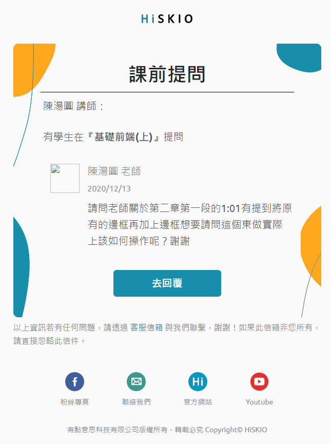
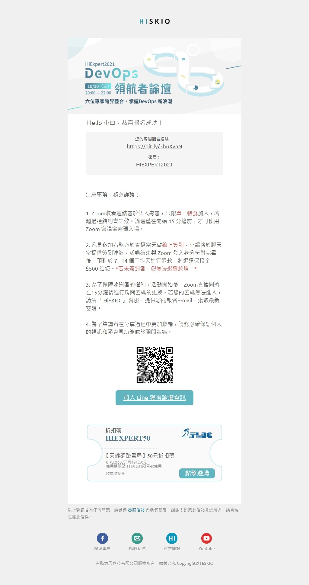

# 信件模板的對應說明

| 信件名稱                           | 信件位置                                    | 截圖                                                                                                   |
| ---------------------------------- | ------------------------------------------- | ------------------------------------------------------------------------------------------------------ |
| 三人同行系統自動註冊歡迎信         | 三人同行系統自動註冊歡迎信                  |                              |
| 六角化前端資源信件                 | 六角化前端資源信件                          |                                              |
| 六角活動-購課成功信件              | 六角活動-購課成功信件                       |                                       |
| 預約成功信                         | 快速面試/預約成功信                         |                                                    |
| 職缺應徵成功信                     | 快速面試/職缺應徵成功信                     |                                            |
| 抵用券即將到期                     | 抵用券即將到期                              |                                                      |
| 直播銷售-報名成功                  | 直播銷售-報名成功                           |                                               |
| 促銷信件                           | 促銷信件                                    |                                                                 |
| 前端領航者論壇                     | 前端領航者論壇                              |                                                      |
| 後端領航者論壇                     | 後端領航者論壇                              |                                                     |
| 孫志華-購課成功信件                | 孫志華-購課成功信件                         |                                           |
| 挽回信件                           | 挽回信件                                    |                                                                 |
| 退款申請信                         | 退款申請信                                  |                                                              |
| 退費成功信                         | 退費成功信                                  |                                                             |
| 啟用您的帳戶信                     | 啟用您的帳戶信                              |                                                      |
| 程式交易購買完成信件               | 程式交易購買完成信件                        |                                         |
| 程式交易贈送策略信件               | 程式交易贈送策略信件                        |                                         |
| 正式開課(已購課學員)               | 募資課程/正式開課(已購課學員)               | /screenshot.png>)                              |
| 即將漲價                           | 募資課程/即將漲價                           |                                                        |
| 即將漲價(含組合課程)               | 募資課程/即將漲價(含組合課程)               | /screenshot.jpeg>)                             |
| 退款通知(信用卡)                   | 募資課程/退款通知(信用卡)                   | /screenshot.png>)                                      |
| 退款通知(ATM)                      | 募資課程/退款通知(ATM)                      | /screenshot.png>)                                            |
| 募資失敗-組合課程包含單堂募資失敗  | 募資課程/募資失敗-組合課程包含單堂募資失敗  |       |
| 募資失敗-單堂課程募資失敗          | 募資課程/募資失敗-單堂課程募資失敗          |                       |
| 募資成功信(學生)                   | 募資課程/募資成功信(學生)                   | /screenshot.png>)                                      |
| 募資成功信(講師)                   | 募資課程/募資成功信(講師)                   | /screenshot.png>)                                      |
| 關注的課程已經開課                 | 募資課程/關注的課程已經開課                 |                                     |
| 關注的課程即將結束募資             | 募資課程/關注的課程即將結束募資             |                             |
| 關注的課程即將結束募資(含組合課程) | 募資課程/關注的課程即將結束募資(含組合課程) | /screenshot.jpeg>) |
| 零元挑戰賽                         | 零元挑戰賽                                  |                                                             |
| 合授資格取消通知                   | 管理後台/合授資格取消通知                   |                                         |
| 合授講師邀請信件                   | 管理後台/合授講師邀請信件                   |                                         |
| 會員停權通知信                     | 管理後台/會員停權通知信                     |                                             |
| 會員資格啟用通知                   | 管理後台/會員資格啟用通知                   |                                         |
| 講師權限變更通知                   | 管理後台/講師權限變更通知                   |                                         |
| 課前提問信                         | 講師後台/課前提問信                         |                                                     |
| 課程公告信                         | 講師後台/課程公告信                         |                                                    |
| 課程提問通知信                     | 講師後台/課程提問通知信                     |                                             |
| 課程新評價通知信                   | 講師後台/課程新評價通知信                   |                                         |
| 學生繳交作業通知信                 | 講師後台/學生繳交作業通知信                 |                                     |
| 講師三天未回提問通知信             | 講師後台/講師三天未回提問通知信             |                             |
| 購買課程通知                       | 講師後台/購買課程通知                       |                                                 |
| 購買課程成功                       | 購買課程成功                                |                                                         |
| 歡迎加入信件                       | 歡迎加入信件                                |                                                          |
| codeFree-完課信件                  | codeFree-完課信件                           |                                               |
| codeFree-推薦成功永久獲得          | codeFree-推薦成功永久獲得                   |                                |
| codeFree-推薦成功獲得天數          | codeFree-推薦成功獲得天數                   |                               |
| codeFree-學習快到期                | codeFree-學習快到期                         |                                           |
| codeFree-歡迎信                    | codeFree-歡迎信                             |                                                   |
| DevOps 領航者論壇                  | DevOps 領航者論壇                           |                                                 |
